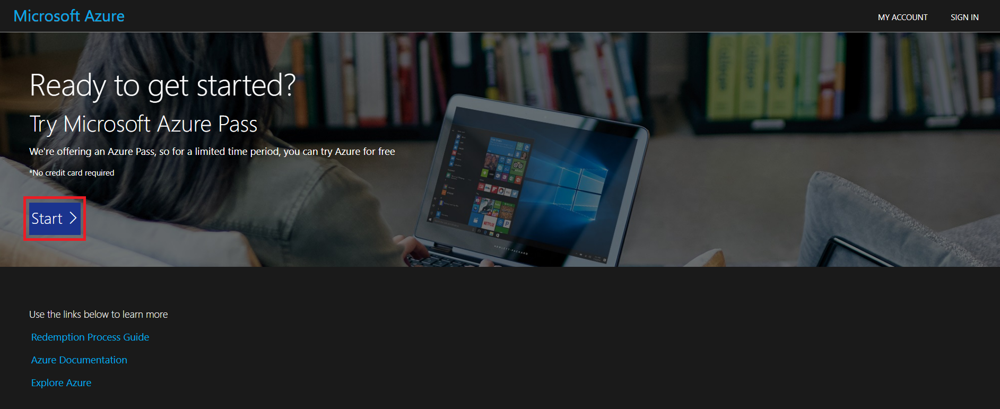
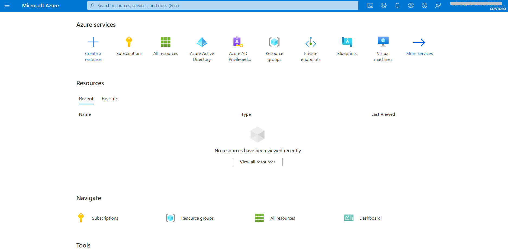
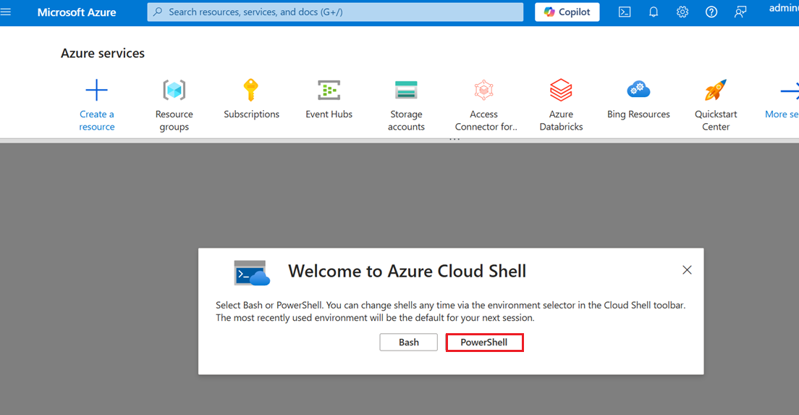
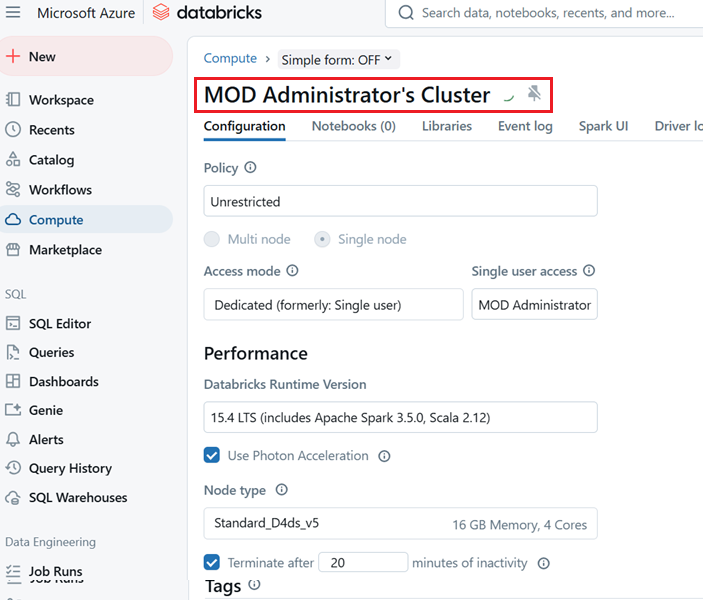
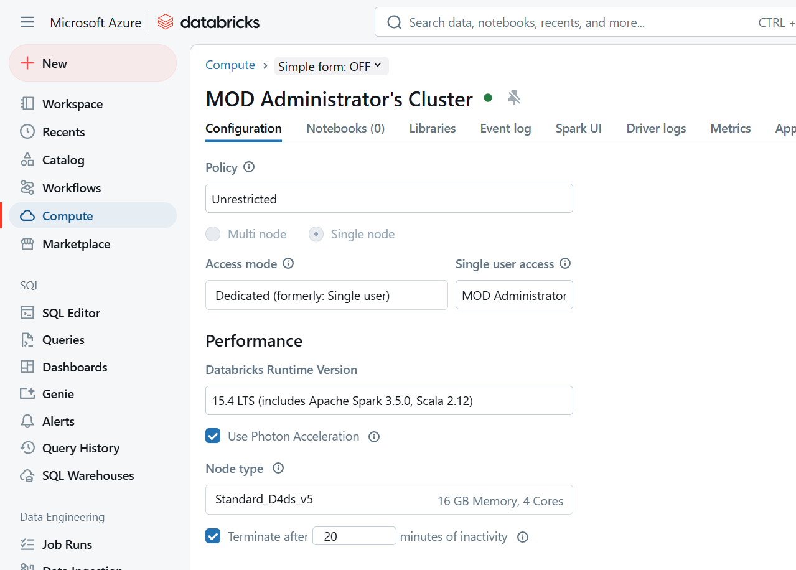
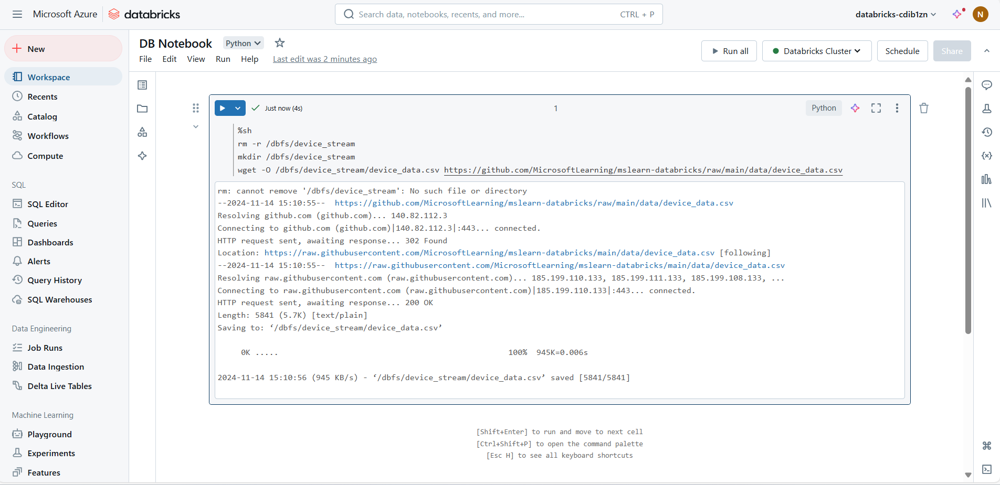
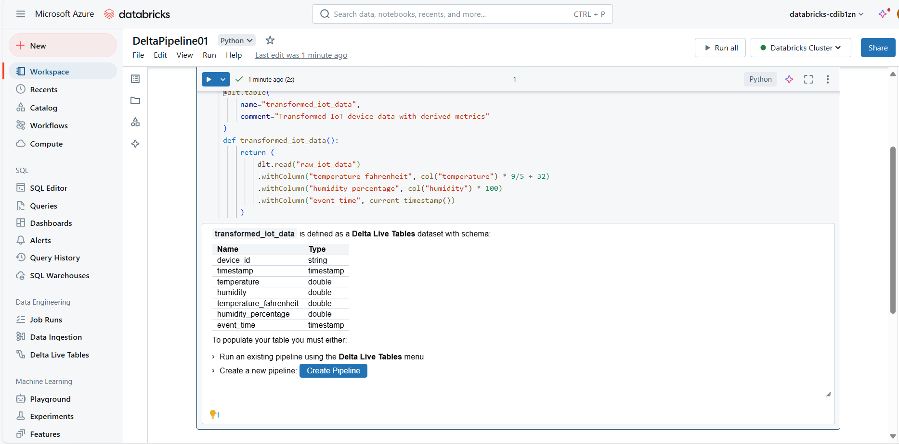

# Use Case 01 - End-to-End Streaming Pipeline with Delta Live Tables in Azure Databricks 

Solution focus area

Contoso Corp, a mid-sized manufacturing company, is dedicated to
delivering the highest quality products to its customers. To achieve
this, Contoso Corp focuses on ensuring the optimal performance of its
machinery by continuously monitoring various IoT sensors installed on
the equipment. By leveraging Azure Databricks and real-time data
streaming, the company can ingest, process, and analyze data from these
sensors. This advanced approach allows Contoso Corp to detect anomalies
early and predict maintenance needs, thereby maintaining the efficiency
and reliability of their manufacturing processes.

Personas and scenario

- **Remy Morris** - Data Architect for Contoso Corp

- **Mark Brown** - Azure Databricks Data Engineer for Contoso Corp

- **Casey Jensen** - Data Analyst for Contoso Corp

    

These personas will participate in the following sequential scenarios:

- Remy Morris, Data Architect for Contoso Corp, is responsible for
  designing the overall data architecture and strategy for Contoso Corp.
  He ensures that the data infrastructure is scalable, secure, and
  capable of handling real-time data streams from IoT sensors. Remy
  selects appropriate technologies and tools for data ingestion,
  processing, and storage.

- Mark Brown, Azure Databricks Engineer for Contoso Corp, works closely
  with Remy to set up the real-time data streaming and processing
  workflows. He provides an Azure Databricks workspace and creates Azure
  Databricks clusters and notebooks for data ingestion and processing.
  Mark implements real-time data streaming solutions using Azure
  Databricks.

- Casey Jensen, Data Analyst for Contoso Corp, analyzes the ingested and
  processed data to extract actionable insights. She creates reports and
  dashboards to help the operations team monitor machinery performance
  and predict maintenance needs.


**Important Note:** Copy all the scripts into Notepad and ensure they are used properly.

# Exercise 1: Provision an Azure Databricks workspace

**(Led by Remy Morris, Data Architect)**

**Scenario: Laying the Foundation**

Remy needs to set up the foundational infrastructure for the real-time
data streaming solution. He decides to provision a new Azure Databricks
workspace, which will serve as the processing engine for IoT sensor
data.

***Tip**: If you already have an Azure Databricks workspace, you can
skip this procedure and use your existing workspace.*

This exercise includes a script to provision a new Azure Databricks
workspace. The script attempts to create a *Premium* tier Azure
Databricks workspace resource in a region in which your Azure
subscription has sufficient quota for the compute cores required in this
exercise; and assumes your user account has sufficient permissions in
the subscription to create an Azure Databricks workspace resource.

If the script fails due to insufficient quota or permissions, you can
try to create an Azure Databricks workspace interactively in the Azure
portal

## Task 0: Sync Host environment time

1.  In your VM, navigate and click in the **Search bar**, type
    **Settings** and then click on **Settings** under **Best match**.

    

2.  On Settings window, navigate and click on **Time & language**.

    

3.  On **Time & language** page, navigate and click on **Date & time**.

    

4.  Scroll down and navigate to **Additional settings** section, then
    click on **Syn now** button. It will take 3-5 minutes to syn.

      

5.  Close the **Settings** window.

      

## Task 0: Redeem Azure Pass

1.  Open a new tab on your browser and browse to the **Microsoft Azure
    Pass** website using the given
    link +++https://www.microsoftazurepass.com/+++.

2.  Click on **Start**.

      

3.  Enter the **Office 365 tenant credentials** from the Lab
    VM(**Resources** tab) and **Sign In**.

     
     

4.  Verify email id and then click on **Confirm Microsoft Account**.

     

5.  Paste the **promo code** from the Resources tab in the **Enter Promo
    code** box and click **Claim Promo Code**.

     
     

6.  It may take few seconds to process the redemption.

7.  Fill in the details appropriately on the **Sign up** page.

8.  On the **Agreement** window, select the check box - I agree to the
    subscription agreement, offer details, and privacy statement, and
    then click on **Sign up**.

     

9.  You may **Submit** the feedback while the account setup is in
    progress.

     
     

10. The account setup will take about 2-3 minutes to complete. It would
    automatically redirect you to the **Azure Portal** and now you are
    ready to use Azure services.

      

## Task 2: Create an Azure Databricks workspace

1.  Open your browser, navigate to the address bar, type or paste the
    following URL: +++https://portal.azure.com/+++, then press the
    **Enter** button.

      

2.  In the **Sign in** window, enter the **Username** and click on the
    **Next** button.

    

3.  Then, enter the password and click on the **Sign in** button**.**

     

4.  In **Stay signed in?** window, click on the **Yes** button.

      

5.  On **Welcome to Microsoft Azure** dialog box, click on **Maybe
    later** button.

     

6.  Select the **Cloud Shell** icon in the Azure portal toolbar to open
    a new Cloud Shell pane at the bottom of your browser window.
    Select **Powershell**.

     
    
     

7.  Select **No storage account required** radio button, and select your
    subscription and then click on **Apply**.

     

    > ***Note 1**: If you have previously created a cloud shell that uses
    > a Bash environment, use the the drop-down menu at the top left of the
    > cloud shell pane to change it to **PowerShell**.*
    >
    > ***Note 2:** that you can resize the cloud shell by dragging the
    > separator bar at the top of the pane, or by using the **—**, **◻**,
    > and **X** icons at the top right of the pane to minimize, maximize,
    > and close the pane. For more information about using the Azure Cloud
    > Shell, see the Azure Cloud Shell documentation

4.  At the Power Shell prompt, run the below command to clone the
    project
      ```
        rm -r mslearn-databricks -f
        git clone https://github.com/MicrosoftLearning/mslearn-databricks
      ```
      

8.  After the repo has been cloned, enter the following command to run
    the **setup.ps1** script, which provisions an Azure Databricks
    workspace in an available region:


      +++./mslearn-databricks/setup.ps1+++
 
      

9.  Wait for the script to complete. It typically takes around 7-8
    minutes

   

## Exercise 2: Create a cluster

**(Led by Mark Brown, Azure Databricks Data Engineer)**

**Scenario: Building the Engine**

With the workspace ready, Mark takes over to set up the computing
environment needed to handle real-time data streams. He creates a
cluster that will power the data processing.

Azure Databricks is a distributed processing platform that uses Apache
Spark **clusters** to process data in parallel on multiple nodes. Each
cluster consists of a driver node to coordinate the work, and worker
nodes to perform processing tasks. In this exercise, you’ll create
a *single-node* cluster to minimize the compute resources used in the
lab environment (in which resources may be constrained). In a production
environment, you’d typically create a cluster with multiple worker
nodes.

**Tip**: If you already have a cluster with a 13.3 LTS or higher runtime
version in your Azure Databricks workspace, you can use it to complete
this exercise and skip this procedure.

### Task 1: Create a cluster in Databricks

1.  In the Azure portal, browse to the **msl-*XXXX*** resource group
    that was created by the script

      
     
      

2.  Select your Azure Databricks Service resource named **databricks-
    *XXXX***.

      

3.  In the **Overview** page for your workspace, use the **Launch
    Workspace** button to open your Azure Databricks workspace in a new
    browser tab; signing in if prompted.

    **Tip**: As you use the Databricks Workspace portal, various tips and
    notifications may be displayed. Dismiss these and follow the
    instructions provided to complete the tasks in this exercise.

       

4.  In the sidebar on the left, select the **(+) New** task, and then
    select **Cluster**.

       
5.  In the **New Cluster** page, create a new cluster with the following
    settings:

    - **Cluster name**: Databricks Cluster

    - **Policy**: Unrestricted

    - **Cluster mode**: Single Node

    - **Access mode**: Single user (*with your user account selected*)

    - **Databricks runtime version**: 13.3 LTS (Spark 3.4.1, Scala 2.12)
      or later

    - **Use Photon Acceleration**: Selected

    - **Node type**: Standard_D4ds_v5

    - **Terminate after** *20* **minutes of inactivity**

      

6.  Wait for the cluster to be created. It may take 5-7 minute.

     
     
**Note**: If your cluster fails to start, your subscription may have
insufficient quota in the region where your Azure Databricks workspace
is provisioned. See CPU core limit prevents cluster creation for
details. If this happens, you can try deleting your workspace and
creating a new one in a different region. You can specify a region as a
parameter for the setup script like this: ./mslearn-databricks/setup.ps1
eastus

## Exercise 3: Create a notebook and ingest data

**(Led by Mark Brown, Azure Databricks Data Engineer)**

**Scenario: Bringing the Data to Life**

Mark needs to ingest data from IoT sensors placed across the
manufacturing floor. This data includes real-time readings of
temperature and humidity from various machines.

### Task 1: Ingesting data

1.  In the sidebar, use the **(+) New** link to create a **Notebook**.
    In the **Connect** drop-down list, select your cluster if it is not
    already selected. If the cluster is not running, it may take a
    minute or so to start.

    

     
2.  In the first cell of the notebook, enter the following code, which
    uses *shell* commands to download data files from GitHub into the
    file system used by your cluster.

    ```
    %sh
     rm -r /dbfs/device_stream
     mkdir /dbfs/device_stream
     wget -O /dbfs/device_stream/device_data.csv https://github.com/MicrosoftLearning/mslearn-databricks/raw/main/data/device_data.csv
    
    ```

     

3.  Use the **▸ Run Cell** menu option at the left of the cell to run
    it. Then wait for the Spark job run by the code to complete.

     

## Exercise 4: Use delta tables for streaming data

**(Led by Mark Brown, Azure Databricks Data Engineer)**

**Scenario: Streaming the Data Flow**

Mark sets up a real-time streaming pipeline to continuously process data
from the IoT sensors. Using Delta Lake, he ensures data consistency and
enables efficient querying.

Delta lake supports *streaming* data. Delta tables can be a *sink* or
a *source* for data streams created using the Spark Structured Streaming
API. In this example, you’ll use a delta table as a sink for some
streaming data in a simulated internet of things (IoT) scenario. In the
next task, this delta table will work as a source for data
transformation in real time.

### Task 1: Define the Streaming Pipeline:

1.  In a new cell, run the following code to create a stream based on
    the folder containing the csv device data:

        
        from pyspark.sql.functions import *
         from pyspark.sql.types import *
        
         # Define the schema for the incoming data
         schema = StructType([
             StructField("device_id", StringType(), True),
             StructField("timestamp", TimestampType(), True),
             StructField("temperature", DoubleType(), True),
             StructField("humidity", DoubleType(), True)
         ])
        
         # Read streaming data from folder
         inputPath = '/device_stream/'
         iotstream = spark.readStream.schema(schema).option("header", "true").csv(inputPath)
         print("Source stream created...")
        
         # Write the data to a Delta table
         query = (iotstream
                  .writeStream
                  .format("delta")
                  .option("checkpointLocation", "/tmp/checkpoints/iot_data")
                  .start("/tmp/delta/iot_data"))

      

     
    
     

2.  Use the **▸ Run Cell** menu option at the left of the cell to run
    it.

    This delta table will now become the source for data transformation in
    real time.
    
    Note: The code cell above creates the source stream. Therefore, the job
    run will never change to a completed status. To manually stop streaming,
    you can run query.stop() in a new cell.

    

## Exercise 5: Create a Delta Live Table Pipeline

**(Led by Mark Brown, Azure Databricks Data Engineer)**

**Scenario: Transforming Data for Analysis**

Mark now sets up Delta Live Tables to transform raw IoT data. This step
adds derived metrics such as temperature in Fahrenheit and standardized
humidity readings.

### Task 1: Define Delta Live Tables

A pipeline is the main unit for configuring and running data processing
workflows with Delta Live Tables. It links data sources to target
datasets through a Directed Acyclic Graph (DAG) declared in Python or
SQL.

1.  Select **Delta Live Tables** in the left sidebar and then
    select **Create Pipeline**.

     
     

2.  In the **Create pipeline** page, create a new pipeline with the
    following settings. Select Create

    - **Pipeline name**: Ingestion Pipeline

    - **Product edition**: Advanced

    - **Pipeline mode**: Triggered

    - **Source code**: Leave it blank

    - **Storage options**: Hive Metastore

    - **Storage location**: dbfs:/pipelines/device_stream

    - **Target schema**: default

      
    
     

3.  Select **Create pipeline**.

     
     

4.  Once the pipeline is created, open the link to the blank notebook
    under **Source code** in the right-side panel:

     

5.  In the first cell of the notebook, enter the following code to
    create Delta Live Tables and transform the data:

    ```
    import dlt
     from pyspark.sql.functions import col, current_timestamp
         
     @dlt.table(
         name="raw_iot_data",
         comment="Raw IoT device data"
     )
     def raw_iot_data():
         return spark.readStream.format("delta").load("/tmp/delta/iot_data")
    
     @dlt.table(
         name="transformed_iot_data",
         comment="Transformed IoT device data with derived metrics"
     )
     def transformed_iot_data():
         return (
             dlt.read("raw_iot_data")
             .withColumn("temperature_fahrenheit", col("temperature") * 9/5 + 32)
             .withColumn("humidity_percentage", col("humidity") * 100)
             .withColumn("event_time", current_timestamp())
         )
    ```

     
      

6. Next click the delta live table

     

7. To run an existing pipeline, And select the **start** button to
    start the pipeline

      
      

8.  Once the pipeline is successfully executed, go back to the first
    notebook and verify that the new tables have been created in the
    specified storage location with the following code:

    ```
    display(dbutils.fs.ls("dbfs:/pipelines/device_stream/tables"))
    ```

    

## Exercise 6: View results as a visualization

**(Led by Casey Jensen, Data Analyst)**

**Scenario: Extracting Insights**

Casey loads the transformed data to create visualizations that help the
operations team monitor equipment health in real time.

### Task 1: Load the Data into a DataFrame and create a Line Chart.

1.  In the first notebook, add a new code cell and run the following
    code to load the transformed_iot_data into a dataframe:
    
    ```
    df= spark.read.format("delta").load('/pipelines/device_stream/tables/transformed_iot_data')
    display(df)
    
    ```

      


2.  Above the table of results, select **+** and then
    select **Visualization** to view the visualization editor, and then
    apply the following options:

    - **Visualization type**: Line

    - **X Column**: timestamp

    - **Y Column**: *Add a new column and
      select* **temperature_fahrenheit**. *Apply
      the* **Sum** *aggregation*.

     
     
     

3.  Save the visualization and view the resulting chart in the notebook.

## Exercise 7 : Clean up

1.  Navigate to **Azure portal Home** page, click on **Resource
    groups**.

     

2.  Click on the msl-XXX resource group.

     

3.  In the **Resource group** home page, select the **delete resource
    group**

      

4.  In the **Delete Resources** pane that appears on the right side,
    navigate to **Enter “resource group name” to confirm deletion**
    field, then click on the **Delete** button
