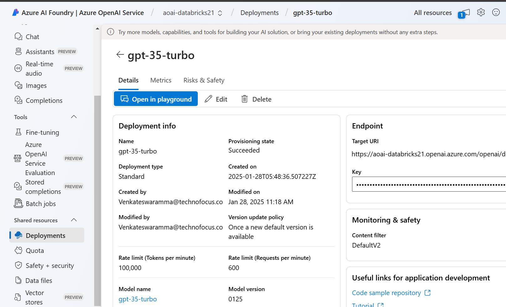
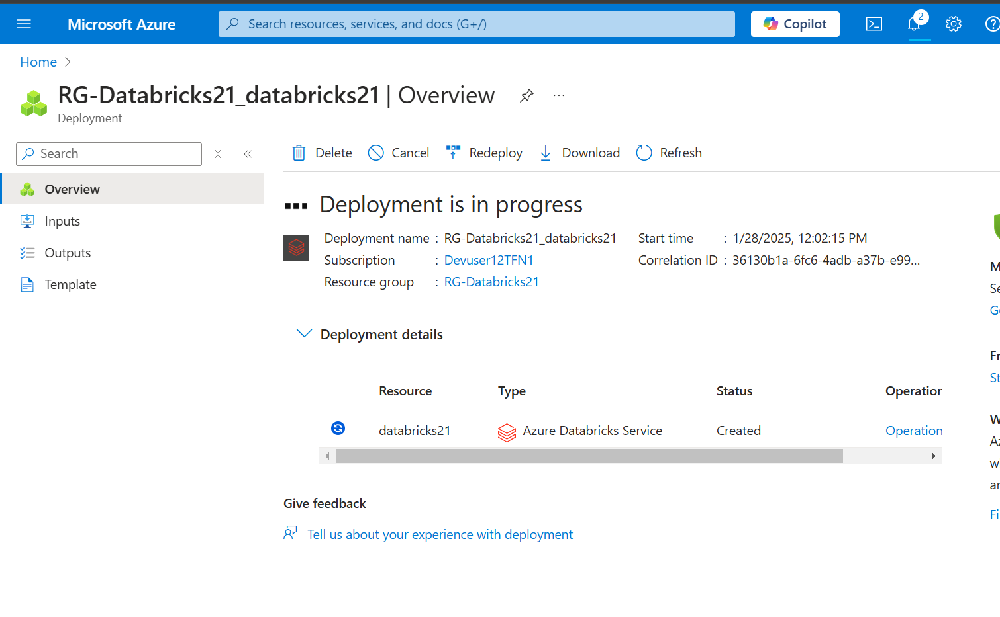
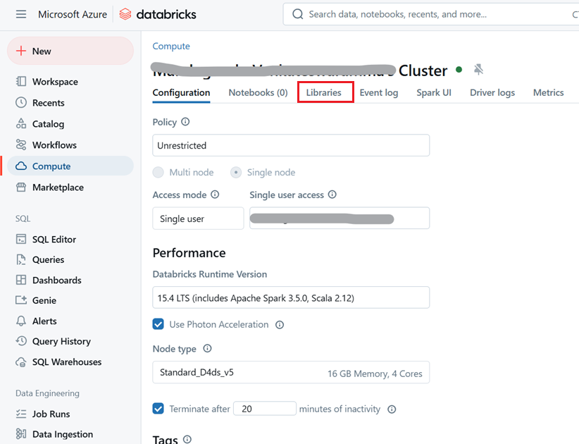
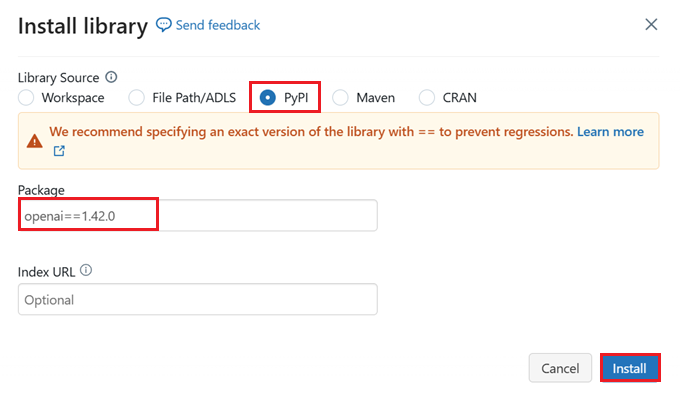
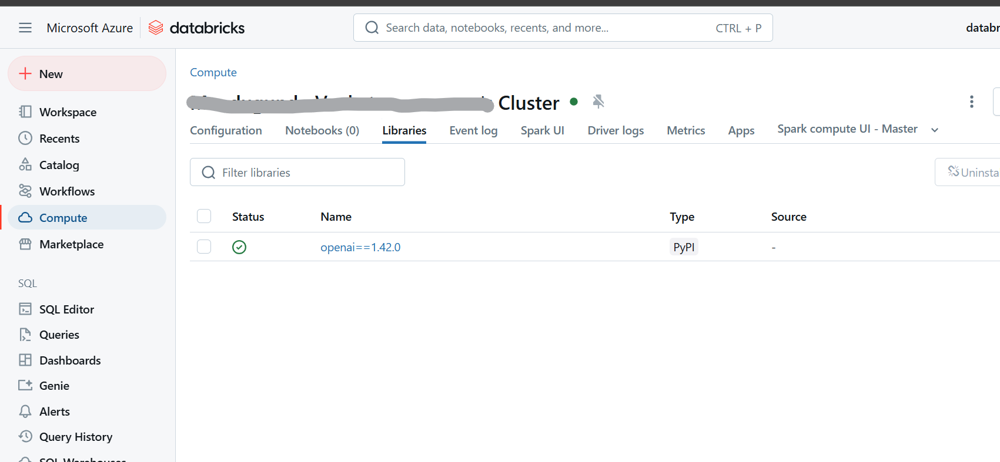
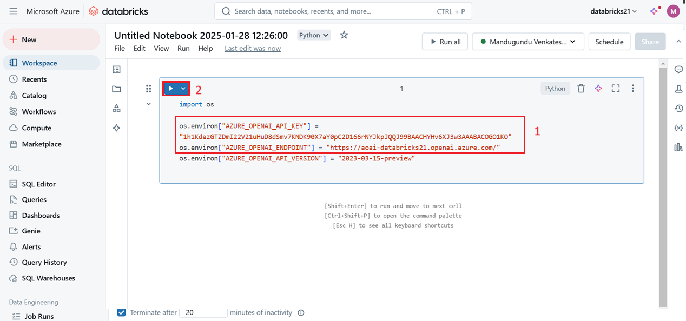
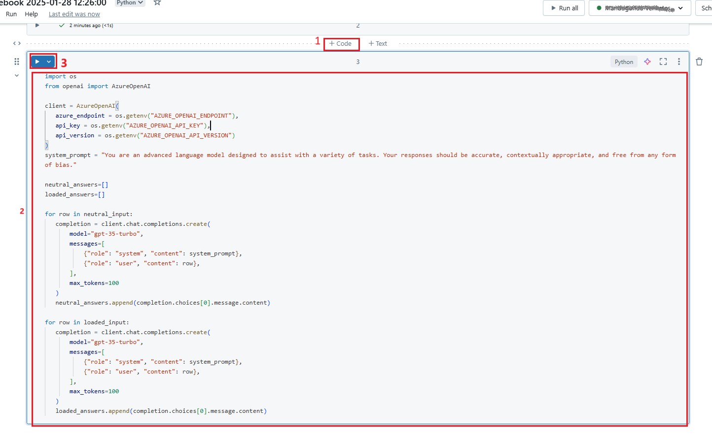
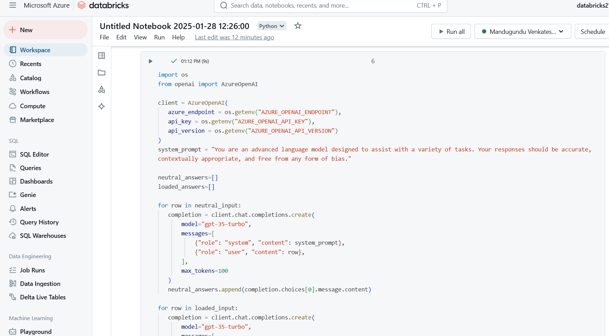

# Use case 04-Explore Unity Catalog in Azure Databricks

Unity Catalog offers a centralized governance solution for data and AI,
simplifying security by providing a single place to administer and audit
data access. In this exercise, you'll configure Unity Catalog for an
Azure Databricks workspace and use it to manage data.

**Note**: In some cases, Unity Catalog may already be enabled for your
workspace. You can still follow the steps in this exercise to assign a
new storage account for your catalog.

This lab will take approximately **45** minutes to complete.

**Note**: The Azure Databricks user interface is subject to continual
improvement. The user interface may have changed since the instructions
in this exercise were written.

**Before you start**

You'll need an [Azure subscription](https://azure.microsoft.com/free) in
which you have global administrator rights.

**IMPORTANT**: This exercise assumes you have *Global
Administrator* rights in your Azure subscription. This level of access
is required to manage the Databricks account in order to enable Unity
Catalog in an Azure Databricks workspace.

## Task 0: Redeem Azure Pass

1.  Open a new tab on your browser and browse to the **Microsoft Azure
    Pass** website using the given
    link <https://www.microsoftazurepass.com/>.

2.  Click on **Start**.

3.  Enter the **Office 365 tenant credentials** from the Lab
    VM(**Resources** tab) and **Sign In**.

> 

4.  Verify email id and then click on **Confirm Microsoft Account**.

5.  Paste the **promo code** from the Resources tab in the **Enter Promo
    code** box and click **Claim Promo Code**.

> 

6.  It may take few seconds to process the redemption.

7.  Fill in the details appropriately on the **Sign up** page.

8.  On the **Agreement** window, select the check box - I agree to the
    subscription agreement, offer details, and privacy statement, and
    then click on **Sign up**.

9.  You may **Submit** the feedback while the account setup is in
    progress.

10. The account setup will take about 2-3 minutes to complete. It would
    automatically redirect you to the **Azure Portal** and now you are
    ready to use Azure services.

## Create an Azure Databricks workspace

**Tip**: If you already have a premium tier Azure Databricks workspace,
you can skip this procedure and use your existing workspace.

1.  Sign into the **Azure portal** at https://portal.azure.com.

2.  Create an **Azure Databricks** resource with the following settings:

    - **Subscription**: *Select your Azure subscription*

    - **Resource group**: *Create a new resource group
      named msl-xxxxxxx (where "xxxxxxx" is a unique value)*

    - **Workspace name**: databricks-xxxxxxx *(where "xxxxxxx" is the
      value used in the resource group name)*

    - **Region**: *Select any available region*

    - **Pricing tier**: *Premium* or *Trial*

    - **Managed Resource Group
      name**: databricks-xxxxxxx-managed *(where "xxxxxxx" is the value
      used in the resource group name)*

3.  Select **Review + create** and wait for deployment to complete.

## Task 2: Prepare storage for the catalog

When using Unity Catalog in Azure Databricks, data is stored in an
external store; which can be shared across multiple workspaces. In
Azure, it's common to use an Azure Storage account with support for a
Azure Data Lake Storage Gen2 hierarchical namespace for this purpose.

> 
>
> 

1.  In the Azure portal, create a new **Storage account** resource with
    the following settings:

    - **Basics**:

      - **Subscription**: *Select your Azure subscription*

      - **Resource group**: *Select the
        existing **msl-xxxxxxx** resource group where you created the
        Azure Databricks workspace.*

      - **Storage account name**: storexxxxxxx *(where "xxxxxxx" is the
        value used in the resource group name)*

      - **Region**: *Select the region where you created the Azure
        Databricks workspace*

      - **Primary service**: Azure Blob Storage or Azure Data Lake
        Storage Gen2

      - **Performance**: Standard

      - **Redundancy**: Locally-redundant storage (LRS) *(For a
        non-production solution like this exercise, this option has
        lower cost and capacity consumption benefits)*

    - **Advanced**:

      - **Enable hierarchical namespace**: *Selected*

> 
>
> 

2.  Select **Review + create** and wait for deployment to complete.

3.  When deployment has completed, go to the
    deployed *storexxxxxxx* storage account resource and use
    its **Storage browser** page to add a new blob container named data.
    This is where the data for your Unity Catalog objects will be
    stored.

## Configure access to catalog storage

To access the blob container you have created for Unity Catalog, your
Azure Databricks workspace must use a managed account to connect to the
storage account through an *access connector*.

1.  In the Azure portal, create a new **Access connector for Azure
    Databricks** resource with the following settings:

    - **Subscription**: *Select your Azure subscription*

    - **Resource group**: *Select the existing **msl-xxxxxxx** resource
      group where you created the Azure Databricks workspace.*

    - **Name**: connector-xxxxxxx *(where "xxxxxxx" is the value used in
      the resource group name)*

    - **Region**: *Select the region where you created the Azure
      Databricks workspace*

2.  Select **Review + create** and wait for deployment to complete. Then
    go to the deployed resource and on its **Overview** page, note
    the **Resource ID**, which should be in the
    format */subscriptions/abc-123.../resourceGroups/msl-xxxxxxx/providers/Microsoft.Databricks/accessConnectors/connector-xxxxxxx* -
    you'll need this later.

3.  In the Azure portal, return to the *storexxxxxxx* storage account
    resource and on its **Access Control (IAM)** page, add a new role
    assignment.

4.  In the **Job function roles** list, search for and select
    the **Storage blob data contributor** role.

> 
>
> 

5.  Select **Next**. Then on the **Members** page, select the option to
    assign access to a **Managed Identity** and then find and select
    the connector-xxxxxxx access connector for Azure Databricks you
    created previously (you can ignore any other access connectors that
    have been created in your subscription)

> 
>
> 
>
> 
>
> 

6.  Review and assign the role membership to add the managed identity
    for your *connector-xxxxxxx* access connector for Azure Databricks
    to the Storage blob data contributor role for
    your *storexxxxxxx* storage account - enabling it to access data in
    the storage account.

## Configure Unity Catalog

Now that you have created a blob storage container for your catalog and
provided a way for an Azure Databricks managed identity to access it,
you can configure Unity Catalog to use a metastore based on your storage
account.

1.  In the Azure portal, view the **msl-*xxxxxxx*** resource group,
    which should now contain three resources:

    - The **databricks-*xxxxxxx*** Azure Databricks workspace

    - The **store*xxxxxxx*** storage account

    - The **connector-*xxxxxxx*** access connector for Azure Databricks

2.  Open the **databricks-xxxxxxx** Azure Databricks workspace resource
    you created and earlier, and on its **Overview** page, use
    the **Launch Workspace** button to open your Azure Databricks
    workspace in a new browser tab; signing in if prompted.

> 

3.  In the **databricks-*xxxxxxx*** menu at the top right,
    select **Manage account** to open the Azure Databricks account
    console in another tab.

> https://github.com/MicrosoftLearning/mslearn-databricks/blob/main/Instructions/Exercises/DE-06-Implement-data-privacy.md#explore-unity-catalog-in-azure-databricks
>
> 

**Note**: If ***Manage account*** is not listed or doesn't successfully
open, you may need to have a global administrator add your account to
the ***Account Admin*** role in your Azure Databricks workspace.

If you're using a personal Azure subscription that you created using a
personal Microsoft account (such as an oultook.com account), an
"external" Entra ID account may have been automatically created in your
Azure directory, and you may need to sign in using that account name.

See [***this Q and A
thread***](https://learn.microsoft.com/answers/questions/2133569/not-able-to-access-databricks-manage-account-conso) for
help.

4.  In the Azure Databricks account console, on the **catalog** page,
    select **Create metastore**.

5.  Create a new metastore with the following settings:

    - **Name**: metastore-xxxxxxx *(where xxxxxxx is the unique value
      you've been using for resources in this exercise)*

    - **Region**: *Select the region where you created your Azure
      resources*

    - **ADLS Gen 2
      path**: data@storexxxxxxx.dfs.core.windows.net/ *(where
      storexxxxxx is the your storage account name)*

    - **Access Connector Id**: *The resource ID for your access
      connector (copied from its Overview page in the Azure portal)*

6.  After creating the metastore, select
    the **databricks-*xxxxxxx*** workspace and assign the metastore to
    it.

**Work with data in Unity Catalog**

Now that you've assigned an eternal metastore and enabled Unity Catalog,
you can use it to work with data in Azure Databricks.

**Create and load a table**

1.  Close the Azure Databricks account console browser tab and return to
    the tab for your Azure Databricks workapace. Then refresh the
    browser.

2.  On the **Catalog** page, select the **Main** catalog for your
    organization and note that schemas
    named **default** and **Information_schema** have already been
    created in your catalog.

3.  Select **Create Schema** and create a new schema named sales (leave
    the storage location unspecified so the default metastore for the
    catalog will be used).

4.  In a new browser tab, download
    the [**products.csv**](https://raw.githubusercontent.com/MicrosoftLearning/mslearn-databricks/main/data/products.csv) file
    from https://raw.githubusercontent.com/MicrosoftLearning/mslearn-databricks/main/data/products.csv to
    your local computer, saving it as **products.csv**.

5.  In the Catalog explorer in Azure Databricks workspace, with
    the **sales** schema selected, select **Create** \> **Create
    table**. Then upload the **products.csv** file you downloaded to
    create a new table named **products** in the **sales** schema.

**Note**: You may need to wait a few minutes for serverless compute to
start.

6.  Create the table. If an AI-generated description is suggested,
    accept it.

**Manage permissions**

1.  With the **products** table selected, on the **Permissions** tab,
    verify that by default there are no permissions assigned for the new
    table (you can access it because you have full administrative
    rights, but no other users can query the table).

2.  Select **Grant**, and configure access to the table as follows:

    - **Principals**: All account users

    - **Privileges**: SELECT

    - **Additional privileges required for access**: Also grant USE
      SCHEMA on main.sales

**Track lineage**

1.  On the **+ New** menu, select **Query** and create a new query with
    the following SQL code:

2.  SELECT Category, COUNT(\*) AS Number_of_Products

3.  FROM main.sales.products

GROUP BY Category;

4.  Ensure serverless compute is connected, and run the query to see the
    results.

5.  Save the query as Products by Category in the workspace folder for
    your Azure Databricks user account.

6.  Return to the **Catalog** page. Then expand the **main** catalog and
    the **sales** schema, and select the **products** table.

7.  On the **Lineage** tab, select **Queries** to verify that the
    lineage from the query you created to the source table has been
    tracked by Unity Catalog.

**Clean up**

In this exercise, you've enabled and configured Unity Catalog for an
Azure Databricks workspace and used it to work with data in a metastore.
To learn more about what you can do with Unity Catalog in Azure
Databricks, see [Data governance with Unity
Catalog](https://learn.microsoft.com/azure/databricks/data-governance/).

If you've finished exploring Azure Databricks, you can delete the
resources you've created to avoid unnecessary Azure costs and free up
capacity in your subscription.
